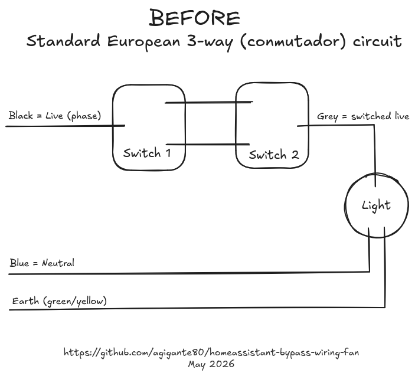
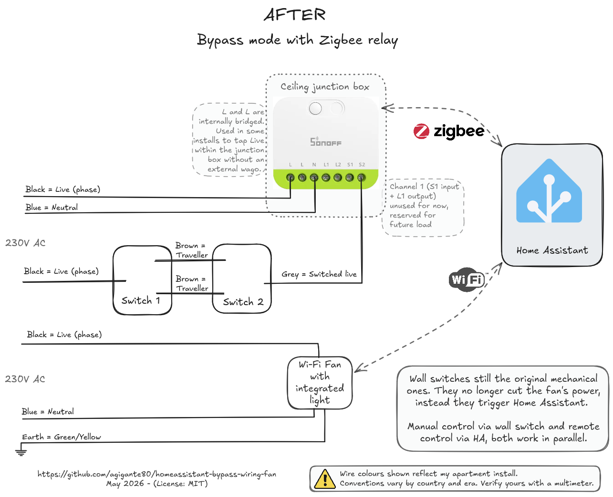

# Home Assistant bypass-wiring for a smart ceiling fan

Make a Tuya / WiFi smart ceiling fan controllable from Home Assistant **without losing the look or feel of the original wall switches**, by adding a Zigbee in-wall relay in bypass-wiring mode. The wall switches keep working mechanically, the fan canopy is always powered (so its WiFi chip never drops), and Home Assistant gets full smart control plus a wall-switch event it can react to.

This repo documents one specific install (SONOFF MINI-ZB2GS Zigbee relay + Ovlaim 132 cm DC ceiling fan in a Spanish two-way / *conmutador* circuit), but the technique is **brand-agnostic** and the included Home Assistant automation is parameterised so you can adapt it to your own house.




> Both PNG diagrams are exported from a single [Excalidraw source file](diagrams/wiring-diagrams.excalidraw). To customise them for your own setup (different brand, different room, different language), upload the `.excalidraw` file to [excalidraw.com](https://excalidraw.com/) or open it in the Excalidraw desktop app, edit, and re-export PNG. Pull requests with diagram improvements are welcome.

> ⚠ **Wire-colour disclaimer.** Wire colour codes vary by country, era, and individual installation. The colours shown in these diagrams (Brown or Black = Live, Blue = Neutral, Grey = switched live, Green/Yellow = Earth) reflect the specific apartment where this build was done and follow modern EU practice. Yours may use entirely different colours for the same electrical roles. Always switch off the breaker, verify with a multimeter, and consult a qualified electrician before working on mains wiring.

## The starting point

This house has a Spanish two-way (*conmutador*) circuit in the living room: two wall switches at opposite ends, sharing two travellers (Spanish: *viajeros*, French: *navettes*) between them, controlling a single ceiling lamp. Standard EU setup, the wall switches sit between the live wire and the lamp and break the circuit when off. [`diagrams/01-before-conmutador.png`](diagrams/01-before-conmutador.png) shows the starting point as-was.

## What I wanted

Replace the dumb light with a **smart ceiling fan that has an integrated light**, controllable from Home Assistant. Concrete use cases:

* Automations like *"if the living-room temperature is above 25 °C between 22:00 and 06:00, run the fan at the lowest speed"*.
* Voice control via Alexa / Google.
* App control via the HA companion app.
* The two existing wall switches should keep working as if nothing changed.

## Why the naive approaches break

The fan I chose ([Ovlaim 132 cm DC](https://www.amazon.es/dp/B08RMN3YRN)) has a Tuya Wi-Fi smart canopy. The canopy holds the speed controller, the LED driver, and the Wi-Fi chip that talks to Home Assistant. That chip needs **constant 230 V** to stay on the Wi-Fi network; if it ever loses power, the canopy takes 20-30 seconds to boot and reconnect.

That single fact rules out every "obvious" wiring option:

| Approach | What it does | Why it fails |
|---|---|---|
| Put a Sonoff (or any smart relay) in line with the wall switch, fan downstream on the relay's load output | Wall switch cuts power to the fan; HA can also toggle the fan over Zigbee | Every time the relay is "off" the canopy loses power and drops off Wi-Fi. Pure dumb-bulb pattern, breaks on a smart load. |
| Same as above, but work around it in HA: every command first turns the relay on, waits 20-30 s for the canopy to boot and reconnect, then sends the actual speed / light command | Eventually works | Adds 20+ seconds of latency to **every** interaction (HA automation, voice command, app tap, wall-switch flip alike). The "smart" device is no longer instantly responsive. Defeats the point. |
| Tape the wall switches permanently to the "on" position | Canopy stays powered | The wall switches become a lie, no real manual control |
| Replace the wall switches with smart switches, put the fan downstream | Single point of control via the smart switch | Canopy still loses power whenever the smart switch is off |
| Hardwire the fan past the switches entirely | Canopy always powered | The wall switches do nothing at all |

## The bypass-wiring approach

Wire the fan canopy **directly to permanent live and neutral, completely bypassing the relay's load output**. The canopy is always powered, always on Wi-Fi, always reachable from HA. [`diagrams/02-after-bypass-wiring.png`](diagrams/02-after-bypass-wiring.png) shows the result.

The wall switches are no longer connected to the load. Instead, the switched-live coming back from the conmutador chain lands on the relay's **S input**. The relay is set to **edge-trigger mode**, so every wall-switch flip toggles the relay's reported switch state in Home Assistant.

A small Home Assistant automation listens to that switch entity and decides what to do with the fan and light: if the light or the fan is currently on, turn both off; if both are off, turn the light on. The wall switch behaves like a smart toggle (light on by default, kill-all when anything is running). The fan canopy stays online forever.

The widely-used name for this layout is **bypass wiring** (Home Assistant community), also called **decoupled switch wiring** (Zigbee2MQTT community) or **smart-bulb wiring** when applied to bulbs. The [terminology table at the bottom of this README](#terminology-bypass-vs-decoupled-vs-detached-vs-smart-bulb-wiring) compares it with a related-but-different firmware feature called **detached / decoupled mode**.

## End result

* **Wall switches look and feel completely normal.** Same brand, same physical click, same wall plate. Anyone in the house can use them without knowing anything changed.
* **The fan canopy never loses power.** HA automations fire instantly, no boot-and-wait penalty between trigger and response.
* **Three control surfaces work in parallel.** Voice control (Alexa / Google), the Home Assistant app, and the wall switches all talk to the same fan independently and stay in sync via HA.

## Hardware

| Part | Used in this build | What to look for if you sub it out |
|---|---|---|
| **Zigbee relay** | [SONOFF MINI-ZB2GS](https://www.amazon.es/dp/B0FV2T1TZK) ("MINI DUO") | Any 2-channel Zigbee relay rated 10 A+, neutral required, edge-trigger mode supported. SONOFF ZBMINIR2 (1 channel) works for single-circuit loads. MOES MS-104BZ is functionally equivalent. |
| **Smart ceiling fan** | [Ovlaim 132 cm DC fan with integrated light](https://www.amazon.es/dp/B08RMN3YRN) (Tuya WiFi canopy) | Native Tuya or Smart Life WiFi (not an RF gateway). DC motor preferred for quietness. 230 V / 50 Hz for EU, 110 V / 60 Hz for US. |
| **Zigbee coordinator** | SONOFF Universal Zigbee 3.0 USB Dongle Plus | Any HA-supported Zigbee coordinator (ConBee, SkyConnect, etc.). |
| **Home Assistant** | HA Core 2026.4.x with ZHA + [tuya_local (HACS)](https://github.com/make-all/tuya-local) | Any modern HA. ZHA or Zigbee2MQTT for the relay; tuya_local for fully-local control of the fan canopy. Cloud Tuya integration works too if you do not mind a cloud round-trip. |

Total cost in mid-2026 from Amazon.es: ~ 18 EUR per relay + ~ 165 EUR for the fan + a one-time ~ 30 EUR for a Zigbee dongle if you do not already have one.

## Wiring

### Where to install the relay

Bypass wiring needs **permanent live + neutral** wherever the relay sits. Two viable locations, pick the one that has the wires and the room in your house:

* **Ceiling junction box** (the option used in this build, and the one I would recommend). Usually has more space, all relevant wires already meet there (live, neutral, both load returns, the traveller pair), and the relay ends up hidden from view. Downside: you work overhead.
* **Wall switch box**. Easier physical access. Workable only if **both live and neutral** are present in the wall box. Common in newer installations, rare in older conmutador wiring where the wall box only carries live and travellers.

In Spanish / European *conmutador* houses, neutral usually only reaches the ceiling rosette or junction box, which makes the ceiling box effectively the only choice. In newer installations either location works and the wall box can be more convenient.

### Steps

The full wire-by-wire mapping is in the diagrams. In short:

1. **Power off** at the breaker. Confirm with a multimeter.
2. **Bring permanent live** to the box where the relay will live. In most installs this means tapping the live side of the existing lighting circuit before the wall switches. If you do not feel comfortable doing this, an electrician's involvement is short and cheap.
3. **Wire the relay's terminals** per the diagram:
   * Permanent live -> `L`. Route Live to the fan canopy from any convenient source: a separate breaker run, an external wago in the junction box, or (on the SONOFF MINI-ZB2GS specifically) by tapping the second `L` terminal which is internally bridged to the first. All three options yield the same bypass behaviour.
   * Neutral -> `N` and also to the fan canopy neutral.
   * Switched-live coming back from the wall-switch chain -> `S2` (or `S1`, your choice).
   * `L1` and `L2` load outputs: **leave capped and unused**.
4. **Connect the fan canopy** to permanent live + neutral, not via the relay. The fan now has 230 V at all times.
5. **Power on**, pair the relay to your Zigbee network, and pair the fan to its Tuya / Smart Life app + Home Assistant.

### About the SONOFF MINI-ZB2GS dual L terminals

The SONOFF MINI-ZB2GS has 7 screw terminals in the order `L L N L1 L2 S1 S2`. The two L terminals are **internally bridged**: both are Live inputs and together they act as a built-in junction inside the relay's screw block. This is a **wiring-convenience feature**, not a bypass-mode feature. Sonoff describes it in their support docs and reviewers consistently call it out: in a typical smart-switch install you need to split the incoming Live wire so that it powers the relay **and** the wall switches' COM terminals. The second L lets you do that without an external wago, saving space in a crowded junction box.

In a bypass install (this project), the second L is sometimes repurposed as a convenient tap point for the always-on load's Live wire (the fan canopy in our case). That works, but it is **optional**:

* You can tap the second L on the Sonoff to feed the load. Convenient when the load lives in the same junction box.
* You can run a separate Live wire from the breaker to the load. Cleaner if the load is on a different circuit or in a different location.
* You can splice externally with a wago. The Sonoff is then identical to any other single-L relay.

All three are valid. **Bypass wiring works on any 2-gang relay** (MOES MS-104BZ, ZBMINI Extreme, Shelly, Aqara, etc.), regardless of whether it has the dual-L convenience. The only thing that defines a bypass install is: the load's Live comes from somewhere other than the relay's L1/L2 output.

Full pinout details and Sonoff's own wiring diagrams are in [`manuals/sonoff_mini_zb2gs_user_manual_EN_V1.0.pdf`](manuals/sonoff_mini_zb2gs_user_manual_EN_V1.0.pdf).

### Safety notes

* The relay must sit **after** an MCB or RCBO rated for 16 A or less (Sonoff requirement).
* `S1` and `S2` only accept the switched-live coming back from a wall switch. **Never** connect them to neutral or earth.
* Earth (green/yellow) conductors are **not drawn** in the included diagrams for clarity. They are present in the real install, run from the breaker earth bar to the fan chassis and to any metal lamp fixture.
* For your jurisdiction, an electrician's involvement may be legally required. This README is engineering documentation, not professional electrical advice.

## Home Assistant automation

The included [`automations/wall_switch_smart_toggle.yaml`](automations/wall_switch_smart_toggle.yaml) is a generic, parameterised version of the smart toggle that runs in this house. Behaviour:

* Trigger: state change of the Zigbee relay's switch entity (any direction).
* If the fan **or** its integrated light is currently on, turn both off.
* Otherwise, turn the integrated light on.

Replace the three placeholders (`<YOUR_WALL_SWITCH_ENTITY>`, `<YOUR_FAN_ENTITY>`, `<YOUR_FAN_LIGHT_ENTITY>`) with the matching entity IDs from your install. The automation file has inline comments explaining each.

### Why this logic

It is the smallest possible behaviour that gives a satisfying "wall switch" feel:

| Light state | Fan state | What flipping the switch does |
|---|---|---|
| off | off | turn the light on (default useful action) |
| on  | off | turn the light off |
| off | on  | turn the fan off |
| on  | on  | turn both off (kill-all) |

You never need two flips to get the room dark, you never need to remember whether the fan was on, and the wall switch always does something visible.

### Variants

* **Always start the fan at a known speed**: replace the `light.turn_on` action with `fan.turn_on` + `light.turn_on` and set `data: {percentage: 17}` for the lowest speed on a 6-speed fan.
* **No integrated light**: drop the `light.*` actions entirely; the toggle then runs fan-on / fan-off.
* **Multiple loads on the same wall switch**: extend the `condition: or` block and add matching `turn_off` actions.

The automation uses `mode: single` so that a double-flip in less than a second is debounced (the second flip is dropped). If you prefer the latest-flip-wins behaviour, change to `mode: restart`.

## What is in this repo

```
.
├── README.md                          this file
├── LICENSE                            MIT, applies to the diagrams, README, and automation YAML only
├── NOTICE.md                          third-party content (PDFs) and their separate licenses
├── automations/
│   └── wall_switch_smart_toggle.yaml  generic, parameterised automation
├── diagrams/
│   ├── 01-before-conmutador.png       starting state: standard European two-way circuit
│   ├── 02-after-bypass-wiring.png     final state: bypass wiring with Zigbee relay + Tuya WiFi fan
│   ├── 03-linkedin-banner.png         landscape (~1.91:1) variant of the AFTER diagram, framed for LinkedIn link-preview crop
│   ├── 04-reddit-before-after.png     portrait BEFORE+AFTER combo on a single image, sized for Reddit inline feed display
│   └── wiring-diagrams.excalidraw     editable source for all four PNGs (open at excalidraw.com)
└── manuals/                           official vendor PDFs, included for offline reference
    ├── sonoff_mini_zb2gs_user_manual_EN_V1.0.pdf
    ├── sonoff_mini_duo_quick_guide_V1.1.pdf       (multi-language quick guide)
    ├── ovlaim_52in_809_instruction_manual.pdf     (full installation + remote manual)
    └── ovlaim_smart_life_app_setup.pdf            (Tuya/Smart Life pairing flow)
```

## Resources

### Official PDFs (included locally + sources)

* SONOFF MINI-ZB2GS User Manual V1.0 EN: [local copy](manuals/sonoff_mini_zb2gs_user_manual_EN_V1.0.pdf) | [source: TinyTronics](https://www.tinytronics.nl/product_files/007652_sonoff-mini-zb2gs-zigbee-switch-user-manual.pdf)
* SONOFF MINI DUO Quick Guide V1.1 (multi-language): [local copy](manuals/sonoff_mini_duo_quick_guide_V1.1.pdf) | [source: SONOFF support](https://support.sonoff.tech/mini-zb2gs-usermanual/)
* Ovlaim 52-inch / Model 809 Instruction Manual: [local copy](manuals/ovlaim_52in_809_instruction_manual.pdf) | [source: manuals.plus](https://manuals.plus/asin/B08NSKDM5R)
* Ovlaim Smart Life app setup guide: [local copy](manuals/ovlaim_smart_life_app_setup.pdf) | source: shipped with the product

### External (not bundled)

* SONOFF MINI-ZB2GS product page: [Amazon.es B0FV2T1TZK](https://www.amazon.es/dp/B0FV2T1TZK) | [SONOFF support](https://support.sonoff.tech/mini-zb2gs-usermanual/)
* Ovlaim 132 cm DC fan product page: [Amazon.es B08RMN3YRN](https://www.amazon.es/dp/B08RMN3YRN)
* SONOFF smart-switch wiring guide (single-pole, 3-way, no neutral): [SONOFF blog](https://sonoff.tech/en-us/blogs/news/smart-switch-wiring-what-every-homeowner-electrician-should-know)
* SmartHomeScene independent review of MINI DUO and MINI DUO-L: [SmartHomeScene](https://smarthomescene.com/reviews/sonoff-mini-duo-mini-duo-l-zigbee-smart-switches-review/)
* Home Assistant `tuya_local` integration: [github.com/make-all/tuya-local](https://github.com/make-all/tuya-local)

## License

This project's original content (the README, the two diagrams, and the automation YAML) is released under the [MIT License](LICENSE). You can copy, modify, and redistribute freely as long as you keep the copyright notice. The bundled vendor PDFs in `manuals/` are **not** covered by the MIT license: they are the respective property of SONOFF (Shenzhen Sonoff Technologies Co., Ltd.) and Ovlaim, and are included verbatim for offline convenience. See [NOTICE.md](NOTICE.md) for the full attribution.

---

## Terminology: bypass vs decoupled vs detached vs smart-bulb wiring

These four terms appear interchangeably online but they do not all mean exactly the same thing. The distinction matters when you read forum threads, watch tutorials, or copy a wiring diagram from one source and an automation from another.

| Term | Type | What it means | Where you'll see it |
|---|---|---|---|
| **Bypass wiring** / **Bypass mode** | Wiring choice (hardware) | Load is fed from permanent live, not via the relay's load output. Relay's load output is left disconnected. The relay only sees the wall switch on its S input and reports its state. | Home Assistant community, Reddit, this project. Most generic and descriptive name. |
| **Decoupled switch wiring** | Wiring choice (hardware) | Synonym for bypass wiring, framed from the wall-switch's point of view: the switch is *decoupled* from the load and only acts as an input to HA. | Zigbee2MQTT community, smart-bulb tutorials. |
| **Smart-bulb wiring** | Wiring choice (hardware) | Subset of bypass wiring where the always-on load is specifically a smart bulb (which needs constant power to keep its WiFi chip online). Same topology, different vocabulary. | Smart-bulb retailer guides, Hue/LIFX community. |
| **Signal-only** / **S-only wiring** | Wiring choice (hardware) | Niche, precise label. Says the relay sees only an S-input signal, no current flows through its load output. Same setup as bypass. | Electrician-leaning posts. |
| **Detached relay mode** / **Detach relay** | Firmware feature (software toggle on the relay) | **Different concept.** The load **is** wired to the relay's L1/L2 output, but the relay's firmware ignores the S input and keeps the output on regardless of wall-switch state. HA controls the load via Zigbee only. Used when you cannot physically rewire to bypass. | SONOFF docs ("Detach relay" entity in HA), eWeLink app. |
| **Decoupled mode** | Firmware feature (software toggle on the relay) | Zigbee2MQTT's name for the same firmware feature as "detached relay mode" above. Easy to confuse with the wiring term *decoupled switch wiring*; they achieve a similar end result via different mechanisms. | Zigbee2MQTT device pages. |
| **Switch-only mode** | Firmware feature (software toggle on the relay) | Tasmota's term for the same firmware feature. | Tasmota docs. |
| **Edge-trigger mode** | Firmware feature on the relay | Independent of the above. Says the relay generates a Zigbee event on every voltage transition on its S input (rising and falling edge), rather than tracking absolute S level. Needed for a *conmutador* / 3-way wall-switch chain to act as a toggle input. Sonoff exposes this as `select.*_external_trigger_mode`. | SONOFF, Zigbee2MQTT, ZHA. |
| **Stateless switch** | Behavioural label | A wall switch that emits events but does not hold an on/off state of its own. Your wall switch becomes effectively stateless under bypass wiring. | Home Assistant ecosystem. |
| **Pulse / momentary / latching** | Physical switch type | Describes the *physical* style of the wall switch wired to S. Latching = standard rocker that stays in position (most European wall switches). Momentary = push-button that springs back. Edge-trigger mode handles both. | Electrician's vocabulary, Sonoff manuals. |

The big one to remember: **bypass wiring** (physical) and **detached relay mode** (firmware) can deliver similar end behaviour, but only one of them is happening in this project. If your relay does not expose detached mode, or if you want a brand-agnostic solution that does not depend on a specific firmware version, **bypass wiring** is the safe pick. That is what is documented here.

## Sponsor

I build and maintain this in my own time. It is free, it stays free, and it gets maintained either way.

If it saved you some time and you feel like saying thanks, you can do that at [github.com/sponsors/agigante80](https://github.com/sponsors/agigante80). Entirely optional, and nothing about the project changes either way.
